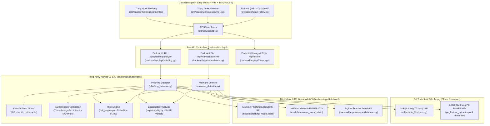
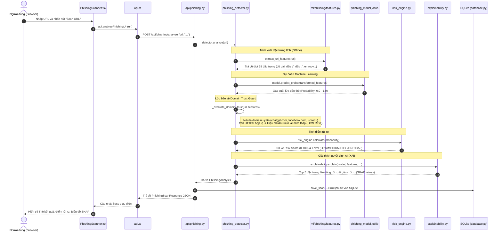
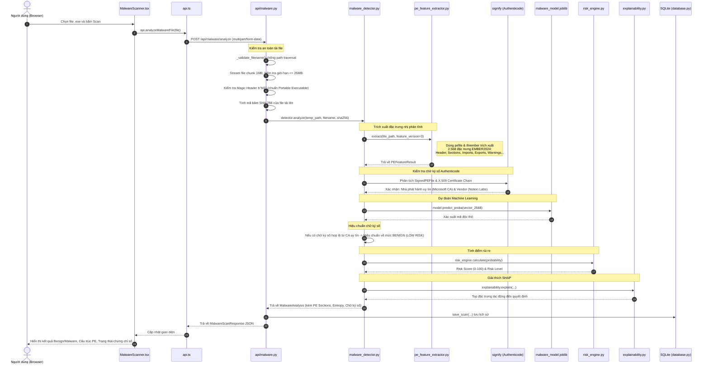

# Hướng Dẫn Luồng Code (Code Flow Architecture Guide)

Tài liệu này giải thích chi tiết toàn bộ kiến trúc và luồng chạy code (Code Flow) của hệ thống **AI Cybersecurity Scanner**, giúp bạn nắm rõ từng tính năng AI bắt đầu từ file nào, đi qua những file nào, và trả kết quả hiển thị ra sao.

---

## 1. Sơ Đồ Kiến Trúc Tổng Thể (System Architecture)

---

## 2. Luồng Chức Năng 1: Quét URL Phishing (Phishing Scanner Flow)

Khi người dùng nhập một đường link (ví dụ: `https://chatgpt.com/` hoặc `https://facebook.com/messages/t/3426561450703929`) và nhấn **Scan URL**:

### Chi tiết các file tham gia:
1. **[`src/pages/PhishingScanner.tsx`](file:///C:/Users/chipt/.vscode/AI-cybersecurity-scanner/src/pages/PhishingScanner.tsx)**: Nhận input người dùng, validate sơ bộ, gọi hàm API và render thẻ kết quả rủi ro, thanh đo phần trăm, biểu đồ SHAP waterfall.
2. **[`src/services/api.ts`](file:///C:/Users/chipt/.vscode/AI-cybersecurity-scanner/src/services/api.ts)**: Gửi request `POST /api/phishing/analyze` bằng thư viện Axios tới backend `http://localhost:8000`.
3. **[`backend/app/api/phishing.py`](file:///C:/Users/chipt/.vscode/AI-cybersecurity-scanner/backend/app/api/phishing.py)**: Tiếp nhận request, gọi `PhishingDetector`, sau khi có kết quả sẽ gọi `save_scan()` lưu vào database SQLite rồi trả JSON về client.
4. **[`backend/app/services/phishing_detector.py`](file:///C:/Users/chipt/.vscode/AI-cybersecurity-scanner/backend/app/services/phishing_detector.py)**:
   - `_load_artifacts()`: Kiểm tra tính toàn vẹn của file model qua mã băm SHA-256.
   - `analyze()`: Điều phối toàn bộ quy trình phân tích.
   - `_evaluate_domain_trust()`: Bảo vệ các tên miền chính chủ uy tín khỏi bị cảnh báo sai do ký tự đường dẫn.
5. **[`ml/phishing/features.py`](file:///C:/Users/chipt/.vscode/AI-cybersecurity-scanner/ml/phishing/features.py)**:
   - `extract_url_features(url)`: Tính toán 18 chỉ số thống kê từ vựng của URL (không bao giờ gửi request mạng tới trang đích để đảm bảo an toàn tuyệt đối).
6. **[`backend/app/services/risk_engine.py`](file:///C:/Users/chipt/.vscode/AI-cybersecurity-scanner/backend/app/services/risk_engine.py)**: Quy đổi xác suất toán học của mô hình thành thang điểm bảo mật trực quan từ 0 đến 100 và phân loại cấp bậc:
   - `0 - 29`: **LOW RISK (An toàn / Hợp lệ)**
   - `30 - 59`: **MEDIUM RISK (Đáng ngờ nhẹ)**
   - `60 - 79`: **HIGH RISK (Nguy cơ cao)**
   - `80 - 100`: **CRITICAL RISK (Cực kỳ nguy hiểm / Lừa đảo)**
7. **[`backend/app/services/explainability.py`](file:///C:/Users/chipt/.vscode/AI-cybersecurity-scanner/backend/app/services/explainability.py)**: Dùng thuật toán SHAP (SHapley Additive exPlanations) với TreeExplainer để giải thích rõ vì sao mô hình đưa ra phán đoán đó (đặc trưng nào làm tăng nguy cơ, đặc trưng nào làm giảm nguy cơ).

---

## 3. Luồng Chức Năng 2: Quét Mã Độc File Thực Thi PE (Malware Scanner Flow)

Khi người dùng kéo thả file `.exe` (ví dụ: `notion-windows-installer.exe` hoặc file nghi ngờ) và nhấn **Scan File**:

### Chi tiết các file tham gia:
1. **[`src/pages/MalwareScanner.tsx`](file:///C:/Users/chipt/.vscode/AI-cybersecurity-scanner/src/pages/MalwareScanner.tsx)**: Khu vực kéo thả file, thanh tiến trình upload, hiển thị kết quả phân tích cấu trúc PE (Header, Sections, Entropy, Chữ ký số, SHAP analysis).
2. **[`backend/app/api/malware.py`](file:///C:/Users/chipt/.vscode/AI-cybersecurity-scanner/backend/app/api/malware.py)**:
   - Stream file theo từng khối chunk 1MB để không tốn RAM.
   - Kiểm tra magic header `MZ` ở đầu file nhị phân.
   - Tính toán SHA-256 của file tải lên để bảo đảm tính toàn vẹn.
   - Đẩy việc phân tích vào `run_in_threadpool` để không làm nghẽn Event Loop của server.
3. **[`backend/app/services/malware_detector.py`](file:///C:/Users/chipt/.vscode/AI-cybersecurity-scanner/backend/app/services/malware_detector.py)**:
   - Tự động nhận diện phiên bản đặc trưng (`_detect_expected_feature_version`) để trích xuất nhanh trong 1 lượt (tiết kiệm thời gian quét 50%).
   - Tích hợp thư viện `signify` để phân tích chuỗi chứng chỉ số Authenticode.
   - Hiệu chuẩn điểm rủi ro: Nếu file có chữ ký số số hợp lệ từ các CA hàng đầu thế giới (Microsoft, DigiCert, Sectigo, GlobalSign...), nguy cơ sẽ được giảm về mức an toàn (**BENIGN**).
4. **[`backend/app/services/pe_feature_extractor.py`](file:///C:/Users/chipt/.vscode/AI-cybersecurity-scanner/backend/app/services/pe_feature_extractor.py)**:
   - Trích xuất thông tin tĩnh của file PE mà **không bao giờ thực thi file** (hoàn toàn an toàn trong môi trường sandbox).
   - Hỗ trợ cả 2 chuẩn đặc trưng: `EMBER v2` (2,381 chiều) và `EMBER v3 2024` (2,568 chiều).

---

## 4. Luồng Chức Năng 3: Pipeline Huấn Luyện AI (ML Training Pipeline)

Quy trình chuẩn bị dữ liệu và huấn luyện mô hình diễn ra hoàn toàn tự động qua các script trong thư mục `ml/`:

```mermaid
flowchart LR
    subgraph Data_Sources["Nguồn Dữ Liệu"]
        D1["PhiUSIIL Dataset<br/>(235,795 URLs)"]
        D2["PhishTank 2026<br/>(77,098 Phishing URLs)"]
        D3["Tranco Top 1M<br/>(Tên miền uy tín)"]
    end

    subgraph Data_Engineering["Tiền Xử Lý & Cân Bằng"]
        Build["ml/phishing/build_modern_dataset.py<br/>- Cân bằng dấu gạch /<br/>- Cân bằng Apex domain<br/>- Bổ sung deep path"]
        Raw["data/raw/phishing.csv<br/>(58,304 URLs)"]
        Extract["Trích xuất 18 đặc trưng từ vựng"]
        Processed["data/processed/phishing.csv<br/>(58,304 x 18 ma trận)"]
    end

    subgraph Model_Training["Huấn Luyện & So Sánh (ml/phishing/train.py)"]
        Split["Chia tập 70% Train - 15% Val - 15% Test"]
        Train_RF["Random Forest (300 trees)"]
        Train_XGB["XGBoost (Histogram)"]
        Train_LGB["LightGBM (Col-wise)"]
        Compare["So sánh F1, ROC-AUC, Precision, Recall"]
        Select["Chọn Mô hình Tốt Nhất"]
    end

    subgraph Model_Artifacts["Đóng Gói & Bảo Mật (models/)"]
        Joblib["phishing_model.joblib"]
        Prep["phishing_preprocessor.joblib"]
        Meta["phishing_model_metadata.json<br/>(Kèm chữ ký băm SHA-256)"]
    end

    D1 --> Build
    D2 --> Build
    D3 --> Build
    Build --> Raw
    Raw --> Extract
    Extract --> Processed
    Processed --> Split
    Split --> Train_RF
    Split --> Train_XGB
    Split --> Train_LGB
    Train_RF --> Compare
    Train_XGB --> Compare
    Train_LGB --> Compare
    Compare --> Select
    Select --> Joblib
    Select --> Prep
    Select --> Meta
```

### Các bước thực thi:
1. **Bước 1: Ghép nối & Cân bằng dữ liệu**:
   Chạy `python -m ml.phishing.build_modern_dataset` để tạo ra tập dữ liệu 58,304 mẫu cân bằng hoàn hảo, khắc phục định kiến về dấu gạch chéo cuối `/` và tên miền không có `www.`.
2. **Bước 2: Huấn luyện & Đánh giá mô hình**:
   Chạy `python -m ml.phishing.train --model all` để huấn luyện đồng thời 3 thuật toán hàng đầu:
   - Random Forest
   - XGBoost
   - LightGBM
   Hệ thống tự động so sánh các chỉ số trên tập kiểm định độc lập và chọn ra mô hình tối ưu nhất.
3. **Bước 3: Đóng gói bảo mật**:
   Mô hình được lưu lại vào thư mục `models/` kèm theo file metadata ghi nhận đầy đủ siêu dữ liệu (accuracy, F1, ma trận nhầm lẫn) và mã băm mật mã học **SHA-256** của từng file để chống can thiệp mô hình (model tampering).

---

## 5. Bản Đồ Thư Mục & Vai Trò Từng File (File Dictionary)

| Thư mục / File | Ngôn ngữ | Vai trò & Chức năng |
| :--- | :---: | :--- |
| **`backend/app/main.py`** | Python | Điểm khởi chạy FastAPI backend server, cấu hình CORS và nạp các router. |
| **`backend/app/api/phishing.py`** | Python | Controller nhận request quét URL (`/api/phishing/analyze`). |
| **`backend/app/api/malware.py`** | Python | Controller nhận file tải lên `.exe` (`/api/malware/analyze`). |
| **`backend/app/api/history.py`** | Python | Controller lấy danh sách lịch sử quét (`/api/history`). |
| **`backend/app/services/phishing_detector.py`** | Python | Service phân tích URL lừa đảo, tích hợp **Domain Trust Guard**. |
| **`backend/app/services/malware_detector.py`** | Python | Service phân tích mã độc PE, tích hợp **xác thực chữ ký số Authenticode**. |
| **`backend/app/services/pe_feature_extractor.py`** | Python | Trích xuất tĩnh đặc trưng cấu trúc file PE (EMBER v2 & v3). |
| **`backend/app/services/risk_engine.py`** | Python | Bộ quy đổi điểm rủi ro an ninh (0-100) và 4 cấp bậc rủi ro. |
| **`backend/app/services/explainability.py`** | Python | Giải thích quyết định AI bằng thuật toán SHAP TreeExplainer. |
| **`backend/app/services/artifact_validation.py`** | Python | Kiểm tra tính toàn vẹn chữ ký băm SHA-256 của các file mô hình. |
| **`backend/app/database/database.py`** | Python | Quản lý kết nối và lưu trữ lịch sử quét vào SQLite `scanner.db`. |
| **`ml/phishing/features.py`** | Python | Trích xuất 18 đặc trưng từ vựng tĩnh của URL. |
| **`ml/phishing/build_modern_dataset.py`** | Python | Script tổng hợp dữ liệu từ PhiUSIIL, PhishTank và cân bằng phân phối. |
| **`ml/phishing/train.py`** | Python | Script huấn luyện mô hình Phishing và đánh giá metrics. |
| **`ml/malware/features.py`** | Python | Định nghĩa schema đặc trưng EMBER2024 (2,568 chiều). |
| **`src/pages/PhishingScanner.tsx`** | TypeScript | Giao diện trang web Quét URL Phishing. |
| **`src/pages/MalwareScanner.tsx`** | TypeScript | Giao diện trang web Quét File PE Mã độc. |
| **`src/pages/Dashboard.tsx`** | TypeScript | Giao diện bảng điều khiển tổng quan hệ thống. |
| **`src/services/api.ts`** | TypeScript | Module kết nối HTTP Axios gọi backend API. |
| **`tests/`** | Python | Bộ kiểm thử tự động toàn diện gồm 66 bài test (`pytest`). |

